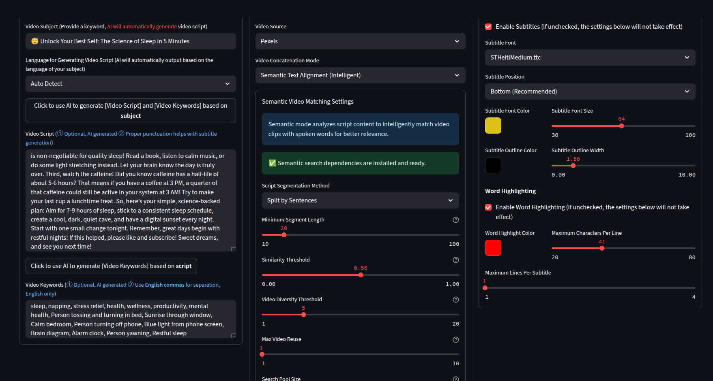
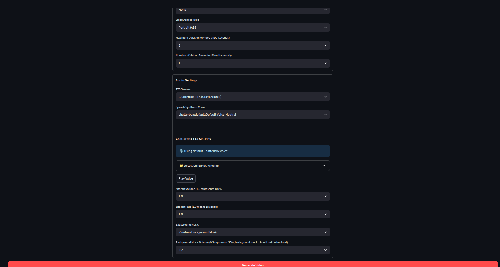

# MoneyPrinterTurbo - Enhanced Fork

This is an enhanced version of [MoneyPrinterTurbo](https://github.com/harry0703/MoneyPrinterTurbo) with significant improvements to subtitle highlighting and TTS capabilities. Full credit goes to the original author and contributors.

## What's Different in This Fork

### Enhanced Subtitle System
- **Word-by-word highlighting**: Each word lights up exactly when spoken, making videos more engaging
- **Real-time synchronization**: Perfect timing with TTS word boundaries
- **Multi-line support**: Works with wrapped text and complex subtitle layouts
- **Customizable colors**: Configure highlight colors through the web interface

### Better Video-Text Matching
- **Semantic search**: Analyzes script content to find relevant video clips instead of random selection
- **Text similarity**: Matches video content to script meaning for better relevance
- **Thumbnail analysis**: Optional video thumbnail similarity for sources like Pexels 

### Open-Source TTS with Voice Cloning
This fork includes **Chatterbox TTS** and **Qwen 1.7B TTS** - completely free alternatives to Azure TTS that run locally on your machine.

**Key advantages:**
- **No API costs**: Completely free to use, no rate limits
- **Voice cloning**: Clone any voice using reference audio (Chatterbox: 10-60s, Qwen: ~3s)
- **Word-level timing**: Perfect subtitle synchronization with WhisperX integration
- **Advanced Models**: Qwen 1.7B offers high-quality 12Hz audio (Note: requires significant GPU memory and downloads weights on first use)
- **Automatic speed control**: Configurable speech pacing via environment variables (Chatterbox only)

### 🖼️ Image Background Mode (Ken Burns Slideshow)
Use still images instead of video clips as backgrounds. Each image gets a cinematic **Ken Burns effect** (slow zoom + gentle pan) with smooth **crossfade transitions** between images.

| Provider | API Key | Cost | License | Quality |
|---|---|---|---|---|
| **Wikimedia Commons** | None | Free | CC/Public Domain | ⭐⭐⭐ |
| **Openverse** | None | Free | CC-Licensed | ⭐⭐⭐⭐ |
| **Flickr** | Required | Free | Mixed (filters open) | ⭐⭐⭐⭐ |
| **Google CSE** | Required | 100 free/day | Mixed | ⭐⭐⭐⭐⭐ |
| **Same Energy** | None | Free | Experimental | ⭐⭐⭐ |

**Enable in UI:** Select *Image (Ken Burns Slideshow)* under Background Media Type → choose your provider.

**API Keys (if needed):**
- **Flickr**: [Get API Key](https://www.flickr.com/services/apps/create/apply/) → add to `config.toml` under `[flickr]`
- **Google CSE**: [Get API Key](https://developers.google.com/custom-search/v1/introduction) + [Create Search Engine](https://programmablesearchengine.google.com/) → add to `[google_cse]`


## Example Videos

See the enhanced features in action:

**Full-Length Video Example**

[](https://www.youtube.com/watch?v=yXc07ROgj80)

**YouTube Shorts Example**  

[](https://www.youtube.com/shorts/JBAuXpVHt40)

**Chatterbox TTS Generated Video**  

[](https://youtube.com/shorts/ZAttF-cVce8?feature=share)

> **Features Showcased**: Natural voice synthesis • Word-level subtitle highlighting • Timing synchronization • Open-source TTS quality

## 🖼️ Screenshots - Video Generation Setup

For complete tranparency and some reprodceability, please see below settings used to generate videos shown above

<div align="center">



</div>


## Show Me The Prompt

Here's the exact prompt system we use for generating engaging YouTube content:

<details>
<summary><strong>Complete Video Generation Prompt For LLMs of your choice(Click to expand)</strong></summary>

```
ROLE: You are an expert YouTube scriptwriter and content strategist specializing in creating engaging, science-backed content for a broad audience.

OBJECTIVE: Generate a complete text-based content package for a 5-minute YouTube video. The goal is to select a single, highly engaging topic and create all the necessary assets to produce the video, optimized for audience retention and YouTube's algorithm.

TOPIC SELECTION CRITERIA:
• Trending & Relevant: The topic must have high current interest and search volume
• Broad Appeal: Relatable to a wide audience (productivity, health, personal finance, psychology)
• Science-Based: Grounded in widely accepted, mainstream scientific consensus
• Safe & Non-Controversial: Focus on foundational, actionable knowledge

REQUIRED DELIVERABLES:

1. Video Title Options (3x)
   Goal: Create three distinct, clickable YouTube titles optimized for high CTR
   Style Example: "Rewire Your Anxious Brain in 3 Simple Steps"

2. Full Video Script
   Length: 800-900 words (~5-minute speaking time)
   Format: Single paragraph with proper punctuation for TTS optimization
   Tone: Authoritative yet encouraging, digestible for general audience
   TTS Optimization: End sentences with definitive punctuation for natural breaks

3. Pexels Video Search Keywords
   Structure: Keywords organized by script concepts for visual variety
   Output: Single line separated by commas
   Example: brain animation, neural network, person thinking, scrolling on phone

4. YouTube Description & Hashtags
   Description: SEO-optimized summary (2-3 lines) with clear call-to-action
   Hashtags: 10-15 relevant hashtags for maximum discoverability
```
</details>

##  Installation

**Quick Start (Recommended):**

```bash
# 1. Clone and setup
git clone https://github.com/harry0703/MoneyPrinterTurbo.git
cd MoneyPrinterTurbo
conda env create -f environment.yml
conda activate MoneyPrinterTurbo

# 2. Install Chatterbox TTS (voice cloning)
git clone https://github.com/resemble-ai/chatterbox.git
cd chatterbox && pip install -e . && cd ..

# 3. Optional: Install Qwen TTS and Flash Attention 2 (for Qwen TTS)
pip install qwen-tts
pip install -U flash-attn --no-build-isolation

## For CUDA specific setup (if needed)
source ./setup_cuda_env.sh    
```

**Usage:**
```bash
# Web Interface (Recommended)
./webui.sh            

## Optional: Customize speech speed when using chatter box
export CHATTERBOX_CFG_WEIGHT=0.1  # Very slow
export CHATTERBOX_CFG_WEIGHT=0.2  # Slow (default)
export CHATTERBOX_CFG_WEIGHT=0.3  # Normal speed
```

The web interface opens at `http://localhost:8501`

## 🔧 Troubleshooting

<details>
<summary><strong>Common Issues & Solutions (Click to expand)</strong></summary>

**Chatterbox TTS issues:**
- **Garbled audio**: Text automatically preprocessed and chunked for clarity
- **CUDA errors**: System automatically falls back to CPU mode
- **Force CPU mode**: `export CHATTERBOX_DEVICE=cpu`
- **Voice cloning problems**: Ensure audio is clear and single-speaker
- **Speed control**: Use `CHATTERBOX_CFG_WEIGHT` environment variable

**Qwen TTS issues:**
- **High VRAM Usage / OOM**: Qwen 1.7B is large. Ensure you have enough VRAM or use CPU mode (slower).
- **Flash Attention Error**: Flash Attention 2 works best on Ampere (RTX 3000 series) or newer. If you encounter errors, it will automatically fall back to 'eager' attention.
- **Emotion Control**: The Qwen base model doesn't support instruction-based emotion control by default.

**CUDA/cuDNN compatibility issues:**
- **Error**: `libcudnn_ops_infer.so.8: cannot open shared object file`
- **Cause**: Missing cuDNN 8.x libraries required by some packages
- **Solution**: Automatically handled by startup scripts (`setup_cuda_env.sh`)
- **Manual fix**: `pip install nvidia-cudnn-cu12==8.9.2.26`

**MoviePy TextClip issues:**
- **Error**: `got an unexpected keyword argument 'align'`
- **Cause**: Newer MoviePy versions removed the `align` parameter
- **Solution**: Remove or comment out `align` parameter in `TextClip` calls

**General issues:**
- Check that all dependencies are installed correctly
- Ensure your Python environment is activated
- For GPU issues, CPU mode provides a reliable fallback

**Advanced CUDA Setup:**
The project includes automatic CUDA environment configuration:
- `setup_cuda_env.sh` - Shared CUDA environment setup
- `webui.sh` - Web interface with CUDA support

If you encounter CUDA library issues, the startup scripts automatically:
1. Add cuDNN library paths to `LD_LIBRARY_PATH` (Linux) 
2. Set optimal CUDA memory allocation settings

</details>

## Contributions and Support 

If you found this project useful please give it a star and consider contributing to it or open an issue if you have an idea that can make it more useful.

## Original Project Credits

This fork maintains full compatibility with the original MoneyPrinterTurbo while adding new features. Check out the [original repository](https://github.com/harry0703/MoneyPrinterTurbo) for the base project documentation and additional features.
